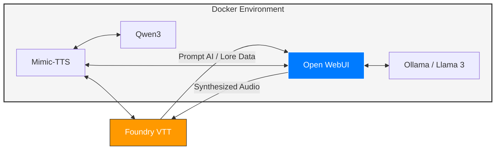

# Foundry AI Assistant

The goal of this project is to build a semi-air gapped AI to support my Foundry VTT D&D sessions.

## Approach:
- Using Docker:
    - [x] Build an Airgapped AI Service using [ollama](https://ollama.com/)
    - [x] Build an AI Dashboard using [open WebUI](https://github.com/open-webui/open-webui)
    - [x] ComfyUI for [qwen3](https://github.com/DarioFT/ComfyUI-Qwen3-TTS)
    - [x] Build an audio TTS system for custom / unique voices for D&D Characters using [Qwen3-TTS](https://github.com/QwenLM/Qwen3-TTS)
    - [x] Integrate AI Prompts & Responses into FoundryVTT
    - [x] Integrate TTS into OpenWeb UI
    - [x] Integrate TTS with FoundryVTT (via script / macro)

 

## Topology:

 

## Docs:
- Setup Instructions: [Docker Notes](docs/docker.md)
- Service: [Mimic TTS](docs/mimic_tts.md)
- Application: [Mimic Voice](docs/mimic_voice.md)
- Notes:
    - [Open-WebUI](docs/openWebUI.md)
    - [Ollama LLM](docs/ollama.md)

 

### Resources:
- Similar project / inspiration: [https://www.youtube.com/watch?v=yik3czBEL2Y](https://www.youtube.com/watch?v=yik3czBEL2Y)
