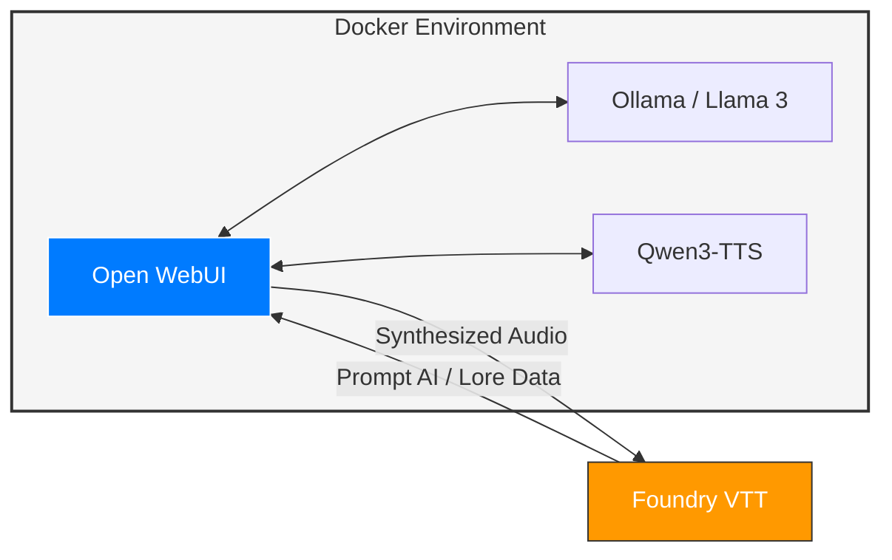

# Foundry AI Assistant

The goal of this project is to build a semi-air gapped AI to support my Foundry VTT D&D sessions.

## Approach:
- Using Docker:
    - [x] Build an Airgapped AI Service using [ollama](https://ollama.com/)
    - [x] Build an AI Dashboard using [open WebUI](https://github.com/open-webui/open-webui)
    - [x] ComfyUI for [qwen3](https://github.com/DarioFT/ComfyUI-Qwen3-TTS)
    - [ ] Build an audio TTS system for custom / unique voices for D&D Characters using [Qwen3-TTS](https://github.com/QwenLM/Qwen3-TTS)
- [x] Integrate AI Prompts & Responses into FoundryVTT
- [ ] Integrate TTS into OpenWeb UI and FoundryVTT

## Foundry VTT Modules of Interest:
- Integrate AI
- FX Master
- NPC Chatter
- Lootsheet NPC
- RPGX AI - Only supports base ollama connection and not to open WebUI preventing RAG / data lookups without premium

 

## Topology:

 

### Resources:
- Similar project / inspiration: [https://www.youtube.com/watch?v=yik3czBEL2Y](https://www.youtube.com/watch?v=yik3czBEL2Y)
